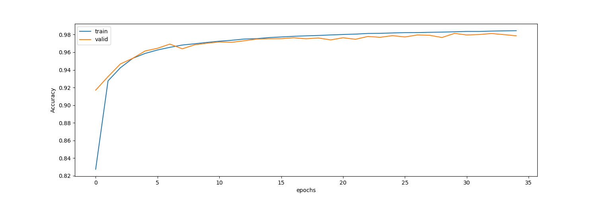
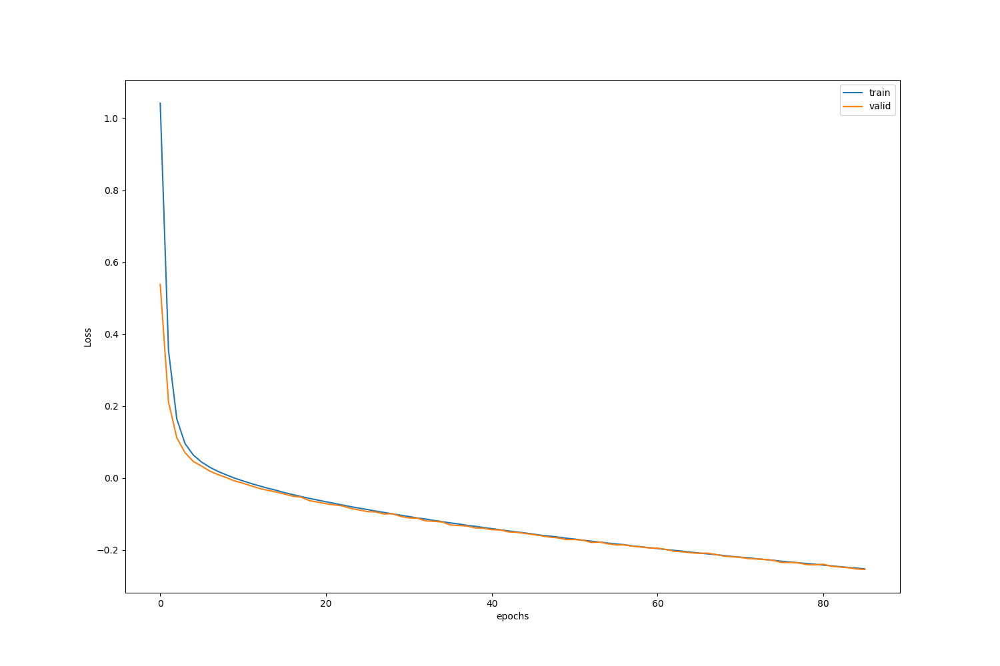

# transformer-word-segmenter

This is a Named entity identification Model base on [Universal Transformer](https://arxiv.org/abs/1807.03819) which can be used for Chinese word segmentation.

## Install

Just use `setup.sh` to install.

## Usage

You can simplely use factory method `get_or_create` to get model.

```python
from tf_segmenter import get_or_create, TFSegmenter

if __name__ == '__main__':
    segmenter: TFSegmenter = get_or_create("../data/default-config.json",
                                           src_dict_path="../data/src_dict.json",
                                           tgt_dict_path="../data/tgt_dict.json",
                                           weights_path="../models/weights.117--0.02.h5")
```

It accepts four params:

- config: which indicates the configuration used by the model
- src_dict_path: which indicates the dictionary file for texts.
- tgt_dict_path: which indicates the dictionary file for tags.
- weights_path: weights file model used.

And then, call `decode_texts` to cut setences.

```python
texts = [
        "昨晚，英国首相特里萨·梅(Theresa May)试图挽救其退欧协议的努力，在布鲁塞尔遭遇了严重麻烦。"
        "倍感失望的欧盟领导人们指责她没有拿出可行的提案来向充满敌意的英国议会兜售她的退欧计划。"
        ,
        "物理仿真引擎的作用，是让虚拟世界中的物体运动符合真实世界的物理定律，经常用于游戏领域，以便让画面看起来更富有真实感。"
        "PhysX是由英伟达提出的物理仿真引擎，其物理模拟计算由专门加速芯片 GPU 来进行处理，"
        "在节省 CPU 负担的同时，还能使物理运算效能成倍提升，由此带来更加符合真实世界的物理效果。"
    ]

for sent, tag in segmenter.decode_texts(texts):
    print(sent)
    print(tag)
```

Results:

```python
['昨晚', '，', '英国', '首相', '特里萨·梅', '(', 'TheresaMay', ')', '试图', '挽救', '其', '退', '欧', '协议', '的', '努力', '，', '在', '布鲁塞尔', '遭遇', '了', '严重', '麻烦', '。', '倍感', '失望', '的', '欧盟', '领导', '人们', '指责', '她', '没有', '拿出', '可行', '的', '提案', '来', '向', '充满敌意', '的', '英国议会', '兜售', '她', '的', '退', '欧', '计划', '。']
['t', 'w', 'ns', 'nnt', 'nrf', 'w', 'x', 'w', 'v', 'vn', 'rz', 'v', 'b', 'n', 'ude1', 'ad', 'w', 'p', 'nsf', 'v', 'ule', 'a', 'an', 'w', 'v', 'a', 'ude1', 'n', 'n', 'n', 'v', 'rr', 'v', 'v', 'a', 'ude1', 'n', 'vf', 'p', 'nz', 'ude1', 'nt', 'v', 'rr', 'ude1', 'vn', 'b', 'n', 'w']
['物理', '仿真', '引擎', '的', '作用', '，', '是', '让', '虚拟世界', '中', '的', '物体', '运动', '符合', '真实', '世界', '的', '物理定律', '，', '经常', '用于', '游戏', '领域', '，', '以便', '让', '画面', '看起来', '更', '富有', '真实感', '。', 'PhysX', '是', '由', '英伟达', '提出', '的', '物理', '仿真', '引擎', '，', '其', '物理模拟', '计算', '由', '专门', '加速', '芯片', 'GPU', '来', '进行', '处理', '，', '在', '节省', 'CPU', '负担', '的', '同时', '，', '还', '能', '使', '物理运算', '效能', '成倍', '提升', '，', '由此', '带来', '更加', '符合', '真实', '世界', '的', '物理', '效果', '。']
['n', 'vn', 'n', 'ude1', 'n', 'w', 'vshi', 'v', 'gi', 'f', 'ude1', 'n', 'vn', 'v', 'a', 'n', 'ude1', 'nz', 'w', 'd', 'v', 'n', 'n', 'w', 'd', 'v', 'n', 'v', 'd', 'v', 'n', 'w', 'x', 'vshi', 'p', 'nz', 'v', 'ude1', 'n', 'vn', 'n', 'w', 'rz', 'nz', 'vn', 'p', 'd', 'vi', 'n', 'x', 'vf', 'vn', 'vn', 'w', 'p', 'v', 'x', 'n', 'ude1', 'c', 'w', 'd', 'v', 'v', 'nz', 'n', 'd', 'v', 'w', 'd', 'v', 'd', 'v', 'a', 'n', 'ude1', 'n', 'n', 'w']

```

config, weigts and dictionaries link:

https://pan.baidu.com/s/1iHADmnSEywoVqq_-nb0bOA password: v34g

## Dataset Process

baidu: https://pan.baidu.com/s/1EtXdhPR0lGF8c7tT8epn6Q password: yj9j

### Convert dataset format

The data format in dataset as follow is not what we liked.

> 嫌疑人\n 赵国军\nr 。\w

We convert it by command:

```python
python ner_data_preprocess.py <src_dir> 2014_processed -c True
```

Where `<src_dir>` indicates training dataset dir, such as `./2014-people/train`.

Now, the data in file `2014_processed` can be seen as follow:


> 嫌 疑 人 赵 国 军 。    B-N I-N I-N B-NR I-NR I-NR S-W

### Make dictionaries

After data format converted, we expect to make dictionaries:

```python
from tf_segmenter.utils import make_dictionaries

if __name__ == '__main__':
    make_dictionaries("2014_processed",
                          src_dict_path="../data/src_dict.json",
                          tgt_dict_path="../data/tgt_dict.json",
                          filters="\t\n",
                          oov_token="<UNK>",
                          min_freq=1)
```

This will generate two file:

- src_dict.json
- tgt_dict.json

see more : `examples\make_dicts_example.py`

### Convert to hdf5 (Optional)

In order to speed up performance, you can convert pure txt `2014_processed` to hdf5 file.

see more : `examples\convert_to_h5_example.py`

## Training Result

The config used as follow:

```json
{
  "src_vocab_size": 6864,
  "tgt_vocab_size": 259,
  "max_seq_len": 256,
  "max_depth": 2,
  "model_dim": 320,
  "confidence_penalty_weight": 0.1,
  "l2_reg_penalty": 1e-06,
  "residual_dropout": 0.2,
  "attention_dropout": 0.0,
  "compression_window_size": null,
  "use_masking": true,
  "num_heads": 8,
  "use_crf": true,
  "label_smooth": true
}
```

And with:

```python
batch_size = 64
steps_per_epoch = 500
validation_steps = 50
```

The training data is divided into training set and verification set according to the ratio of 8:2.

see more: `examples\train_example.py`

After 128 epochs, the accuracy of the verification set reached 98 %.

<div>
    
    
</div>

Test set (`2014-people/test`) evaluation results:

```python
result-(epoch:128):
Word number：8810, Number of words correct rate：0.956640, Number of words error rate：0.049716
Line number：169, Number of lines correct rate：0.396450, Number of lines error rate：0.603550
Recall: 0.956640
Precision: 0.950598
F MEASURE: 0.953609
ERR RATE: 0.049716
```